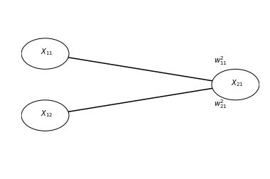
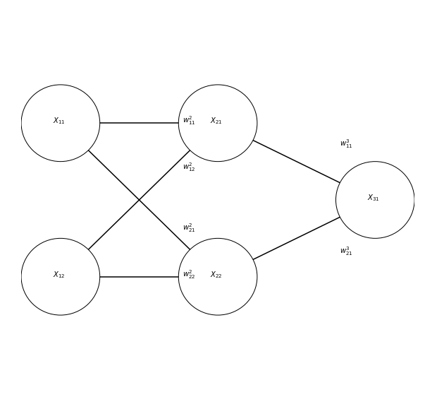

### Why neural networks? Why now?

Artifical neural networks are not a new idea at all. Arguably, these
ideas were around at the dawn of computer science, in the 1940's, and
were clearly articulated in work that continued in the 1950's and 1960's.
In the 1980's this thinking was put to practice in the work of several
groups including the PDP (parallel distributed programming) research group.
But it was really only in the 1990's that computers could be programmed to do
highly useful things with neural networks. For example, the seminal work of
Yann LeCun developing convolutional neural networks that were able to read
hand-written digits.

However, the implementation and application of neural networks to many
different problems really took off in the early 2010's with work that
spanned academic and industry research labs (e.g., work from Andrew Ng's
group at Stanford, in collaboration with researchers at Google, as well
as work from Geoff Hinton's group and Yoshua Bengio, both at the time in
Canada, Toronto and Montreal, respectively).

Some of the factors that ushered in the current golden age of artificial
neural networks are:

1. Development of hardware and software to implement large neural
   networks
2. The availability of large datasets for training these algorithms
3. Theoretical developments across a wide range of fields, including
   ideas closely related to the structure of these networks, but also in
   cognate fields, such as optimization.

One of the landmark datasets that allow us to track these developments
results for the field was the ImageNet dataset that includes millions of
images from 1,000 different classes. This dataset is used as a benchmark
for the performance of object classification systems. In 2012, a neural
network algorithm was able to finally edge out other methods in terms of
accuracy, and more recently these algorithms have reached parity with
human performance.

Since that time, neural network algorithms have been used for a
(increasingly large) number of other applications, including in the
analysis of neuroimaging data.

### How does a neural network work?

The simplest form of a neural network is essentially a regression problem:

Indulge me as I go through the mechanics and notation of this simple network

Variables indicated with $$X_{ij}$$ are nodes and they can have levels of
activity as real (or floating point) numbers. The first sub-script
($$i$$) indicates the layer to which this unit belongs and the second
sub-script ($$j$$) indicates the (arbitrary) identity within the layer.

Weights between layers are indicated by $$W_{ij}^k$$. Here, we'll use the
super-script to indicate the target layer of the weight. First sub-script
indicates the identity of the source unit and second super-script
indicates the identity of the target unit.

So, this network would be implemented as (for example):

~~~
x11 = 1
x12 = 2
w_2_11 = -2
w_2_21 = 3

x21 = w_2_11 * x11 + w_2_21 * x12
~~~
{: .python}

Or alternatively:

~~~
x21 = np.dot([w_2_11, w_2_21], [x11, x12])
~~~
{: .python}

Here is a slightly more complicated network:

And its implementation in code:

~~~
x11 = 1
x12 = 2

w_2_11 = -2
w_2_21 = 3
w_2_12 = 2
w_2_22 = -3

w_3_11 = 3
w_3_21 = 2
~~~
{: .python}

To calculate the output of this one, we need to run several intermediate
computations:

~~~
x21 = np.dot([w_2_11, w_2_21], [x11, x12])
x22 = np.dot([w_2_21, w_2_22], [x11, x12])

x31 = np.dot([w_3_11, w_3_21], [x21, x22])
~~~
{: .python}

Things get more interesting if we allow each unit to be non-linear, by
applying some function to its input:

One popular function (inspired by the fI curve of neurons!) is a hyperbolic tangent:

~~~
x = np.arange(-np.pi, np.pi, 0.001)
plt.plot(x, np.tanh(x))
~~~
{: .python}

Another function that is similar in shape, but much simpler in other respects is
the rectified linear unit:

~~~
def relu(x):
 return np.max([x, np.zeros(x.shape[0])], axis=0)

plt.plot(x, relu(x))
~~~
{: .python}

Our neural network then becomes:

~~~
x21 = relu(np.dot([w_2_11, w_2_21], [x11, x12]))
x22 = relu(np.dot([w_2_21, w_2_22], [x11, x12]))

x31 = relu(np.dot([w_3_11, w_3_21], [x21, x22]))
~~~
{: .python}

### Training the network

Networks are trained through gradient descent: gradual changes to the
values of the weights

The gradients are calculate through **backpropagation**: Error is
propagated back through the network to calculate a gradient (derivative)
for each weight by multiplying:

- The gradient of the loss function with respect to the node a weight feeds into
- The value of the node feeding into the weight
- The slope of the activation function of the node it feeds into

For example, for the network we had above, let's assume the desired
output was 10, instead of 12

~~~
# We take the simplest possible error, the absolute difference:
e31 = x31 - 10

# We'll use this helper function to derive ReLU functions:
def d_relu(x):
    if x > 0:
        return 1
    else:
        return 0

e_3_11 = e31 * x21 * d_relu(x31)
e_3_21 = e31 * x22 * d_relu(x31)

e_2_11 = e_3_11 * x11 * d_relu(x21)
e_2_21 = e_3_11 * x12 * d_relu(x21)

e_2_12 = e_3_21 * x11 * d_relu(x22)
e_2_22 = e_3_21 * x12 * d_relu(x22)
~~~
{: .python}

We set a small learning rate, that will determine how fast we move in the
direction of the gradient:

~~~
lr = 0.01
~~~
{: .python}

And apply the change:

~~~
w_3_11 = w_3_11 - e_3_11 * lr
w_3_21 = w_3_11 - e_3_21 * lr

w_2_11 = w_2_11 - e_2_11 * lr
w_2_12 = w_2_12 - e_2_12 * lr

w_2_21 = w_2_21 - e_2_21 * lr
w_2_22 = w_2_22 - e_2_22 * lr
~~~
{: .python}

We calculate the resulting activations again:

~~~
x21 = relu(np.dot([w_2_11, w_2_21], [x11, x12]))
x22 = relu(np.dot([w_2_21, w_2_22], [x11, x12]))

x31 = relu(np.dot([w_3_11, w_3_21], [x21, x22]))
~~~
{: .python}

And repeat this process again and again, until convergence. If we had
more than one observation for which we knew the input output
relationship, we would use multiple samples to train the network, using each one
one of these pairs.

A full run over all of the data is called an "epoch" of learning. Using
some rather straightforward algebra, the same procedue can be used to
learn from multiple samples at the same time. We call that a "batch". In
our case, the entire dataset is just one observation, so the epoch and
batch both have size of one.
